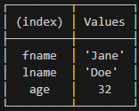
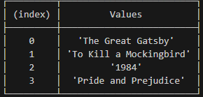

# Understanding ES6
## Var

var was the original way to declare variables in JavaScript.It has a function scope, 
which means that the variable is accessible within the function it's declared in, 
or the global scope if it's declared outside of any function.


```javascript
var x = 5;
var x = 10; // Re-declaring a variable with var is allowed
x = 15; // Reassigning a variable with var is allowed

```
## let

let has a block scope, which means that the variable is accessible within the block it's declared in, including inner blocks.

**let** variables can be reassigned but cannot be re-declared:

```javascript

function example() {
    let x = 5;
    if (true) {
        let x = 10;
        console.log(x); // Output: 10
    }
    console.log(x); // Output: 5
}

console.log(x); // Output: ReferenceError: x is not defined
example();
```

```javascript
let x = 5;
let x = 10; // Error: Identifier 'x' has already been declared
x = 15; // Reassigning a variable with let is allowed

```

## const:

**const** is another way to declare variables in JavaScript that was introduced in ES6.It also has a block scope like let, but once a const variable is declared, it cannot be reassigned or re-declared:

```javascript
const x = 5;
x = 10;         // Error: Assignment to constant variable
const x = 10;     // Error: Identifier 'x' has already been declared
```


However, if a const variable is an **object** or an array, its properties or elements can be modified:


```javascript

const person = { fname: "John",lname:"Doe" };
person.fname = "Jane"; 
person.age = 32; 

console.table(person)

```
  **Output**




As funcitons are not repeted so we store the function into const type varibale.

```javascript
const revString=function(str){
    return str.split('').reverse().join('');
}
console.log(revString('hello 12'))
```
**Output**


** In the Above Code **
## Split()
The split() method splits a string into an array of substrings.

The split() method returns the new array.

The split() method does not change the original string.

If (" ") is used as separator, the string is split between words.

<hr>

## join()

The join() method returns an array as a string.

The join() method does not change the original array.

Any separator can be specified. The default is comma (,).


<hr>

**In summary, var has a function scope, let and const have a block scope, let variables can be reassigned but not re-declared, const variables cannot be reassigned or re-declared, but their properties can be modified if they are objects or arrays.**

<hr>

#  Arrow functions


Arrow functions don't have their own bindings to **this**, **arguments**, or **super**, and should not be used as methods.

Arrow functions cannot be used as **constructors**. Calling them with new throws a TypeError. They also don't have access to the **new.target** keyword.

Arrow functions cannot use **yield** within their body and cannot be created as generator functions.

# Example:

```Javascript
// An empty arrow function returns undefined
const empty = () => {};

(() => "foobar")();
// Returns "foobar"
// (this is an Immediately Invoked Function Expression)

const simple = (a) => (a > 15 ? 15 : a);
simple(16); // 15
simple(10); // 10
```
<hr>


### Array reduce() with arrow function:
```javascript
const expenses = [
  { description: "Rent", amount: 1000 },
  { description: "Groceries", amount: 200 },
  { description: "Transportation", amount: 100 },
  { description: "Utilities", amount: 300 }
];

const totalAmount = expenses.reduce((accumulator, expense) => accumulator + expense.amount, 0);

console.log(totalAmount); // Output: 1600
```
<hr>

### Fiding max number using reduce
```javascript
const numbers = [10, 5, 8, 20, 3, 15];

const maxNumber = numbers.reduce((max, current) => (current > max ? current : max), numbers[0]);

console.log(maxNumber); // Output: 20
```
<hr>

### Filtering

```javascript

const numbers = [10, 5, 8, 20, 3, 15];
const threshold = 10;

const filteredNumbers = numbers.filter(number => number > threshold);

console.log(filteredNumbers); // Output: [20, 15]
```
<hr>

### Map Method

```javascript

const fruits = [
  'Apple',
  'Banana',
  'Orange',
  'Mango'
];

console.log(fruits.map(fruit => fruit)); 
// Output: ['Apple', 'Banana', 'Orange', 'Mango']

console.log(fruits.map(fruit => fruit.length)); 
// Output: [5, 6, 6, 5]
```

```javascript
const books = [
    { title: 'The Great Gatsby', author: 'F. Scott Fitzgerald', price: 12.99 },
    { title: 'To Kill a Mockingbird', author: 'Harper Lee', price: 9.99 },
    { title: '1984', author: 'George Orwell', price: 10.99 },
    { title: 'Pride and Prejudice', author: 'Jane Austen', price: 7.99 }
  ];
  
  const bookTitles = books.map(book => book.title);
  
  console.table(bookTitles);
```
### Output:



###  More concise promise chains
```javascript
promise
  .then((a) => {
    // …
  })
  .then((b) => {
    // …
  });

```
 <hr>

 ## Limitation of Arrow functions:

### 1. No binding of arguments 

```Javascript
function regularFunction() {
  console.log(arguments);
}

regularFunction(1, 2, 3, 4, 5); // Output: [1, 2, 3, 4, 5]


const arrowFunction = () => {
  console.log(arguments);
};

arrowFunction(1, 2, 3, 4, 5); // Output: ReferenceError: arguments is not defined
```
<hr>

###  2. Arrow function Cannot be used as constructors
```Javascript

const Foo = () => {};
const foo = new Foo(); // TypeError: Foo is not a constructor
console.log("prototype" in Foo); // false
```
<hr>

##  The arrow function doesn't have its own binding

#### Using an arrow function in this scenario allows us to avoid issues with losing the context (this) when dealing with asynchronous operations. Arrow functions lexically bind the context from their surrounding scope, ensuring that the this within the arrow function refers to the correct object (car in this case).
<hr>

```javascript
const car = {
  brand: 'Tesla',
  model: 'Model 3',
  batteryLevel: 50,
  checkBatteryLater() {
    // The method syntax binds "this" to the "car" context.

    // Simulating an asynchronous operation using setTimeout
    setTimeout(() => {
      // Since the arrow function doesn't have its own binding and
      // setTimeout (as a function call) doesn't create a binding
      // itself, the "car" context of the outer method is used.

      // Perform some logic with the car's context
      if (this.batteryLevel < 20) {
        console.log('Battery is low. Please charge the car.');
      } else {
        console.log('Battery level is sufficient.');
      }
    }, 2000);
  },
};

car.checkBatteryLater(); // Output: Battery level is sufficient.
```