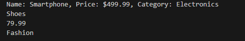
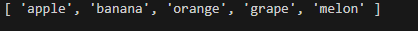
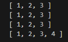
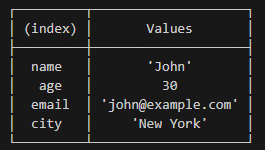
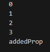
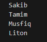
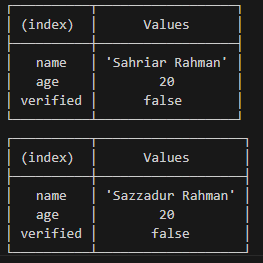
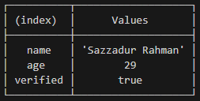

# Understanding ES6
## Var

var was the original way to declare variables in JavaScript.It has a function scope, 
which means that the variable is accessible within the function it's declared in, 
or the global scope if it's declared outside of any function.


```javascript
var x = 5;
var x = 10; // Re-declaring a variable with var is allowed
x = 15; // Reassigning a variable with var is allowed

```
## let

let has a block scope, which means that the variable is accessible within the block it's declared in, including inner blocks.

**let** variables can be reassigned but cannot be re-declared:

```javascript

function example() {
    let x = 5;
    if (true) {
        let x = 10;
        console.log(x); // Output: 10
    }
    console.log(x); // Output: 5
}

console.log(x); // Output: ReferenceError: x is not defined
example();
```

```javascript
let x = 5;
let x = 10; // Error: Identifier 'x' has already been declared
x = 15; // Reassigning a variable with let is allowed

```

## const:

**const** is another way to declare variables in JavaScript that was introduced in ES6.It also has a block scope like let, but once a const variable is declared, it cannot be reassigned or re-declared:

```javascript
const x = 5;
x = 10;         // Error: Assignment to constant variable
const x = 10;     // Error: Identifier 'x' has already been declared
```


However, if a const variable is an **object** or an array, its properties or elements can be modified:


```javascript

const person = { fname: "John",lname:"Doe" };
person.fname = "Jane"; 
person.age = 32; 

console.table(person)

```
  **Output**


As funcitons are not repeted so we store the function into const type varibale.

```javascript
const revString=function(str){
    return str.split('').reverse().join('');
}
console.log(revString('hello 12'))
```
**Output**


** In the Above Code **
## Split()
The split() method splits a string into an array of substrings.

The split() method returns the new array.

The split() method does not change the original string.

If (" ") is used as separator, the string is split between words.

<hr>

## join()

The join() method returns an array as a string.

The join() method does not change the original array.

Any separator can be specified. The default is comma (,).


<hr>

**In summary, var has a function scope, let and const have a block scope, let variables can be reassigned but not re-declared, const variables cannot be reassigned or re-declared, but their properties can be modified if they are objects or arrays.**

<hr>

#  Arrow functions


Arrow functions don't have their own bindings to **this**, **arguments**, or **super**, and should not be used as methods.

Arrow functions cannot be used as **constructors**. Calling them with new throws a TypeError. They also don't have access to the **new.target** keyword.

Arrow functions cannot use **yield** within their body and cannot be created as generator functions.

# Example:

```Javascript
// An empty arrow function returns undefined
const empty = () => {};

(() => "foobar")();
// Returns "foobar"
// (this is an Immediately Invoked Function Expression)

const simple = (a) => (a > 15 ? 15 : a);
simple(16); // 15
simple(10); // 10
```
<hr>


### Array reduce() with arrow function:
```javascript
const expenses = [
  { description: "Rent", amount: 1000 },
  { description: "Groceries", amount: 200 },
  { description: "Transportation", amount: 100 },
  { description: "Utilities", amount: 300 }
];

const totalAmount = expenses.reduce((accumulator, expense) => accumulator + expense.amount, 0);

console.log(totalAmount); // Output: 1600
```
<hr>

### Fiding max number using reduce
```javascript
const numbers = [10, 5, 8, 20, 3, 15];

const maxNumber = numbers.reduce((max, current) => (current > max ? current : max), numbers[0]);

console.log(maxNumber); // Output: 20
```
<hr>

### Filtering

```javascript

const numbers = [10, 5, 8, 20, 3, 15];
const threshold = 10;

const filteredNumbers = numbers.filter(number => number > threshold);

console.log(filteredNumbers); // Output: [20, 15]
```
<hr>

### Map Method

```javascript

const fruits = [
  'Apple',
  'Banana',
  'Orange',
  'Mango'
];

console.log(fruits.map(fruit => fruit)); 
// Output: ['Apple', 'Banana', 'Orange', 'Mango']

console.log(fruits.map(fruit => fruit.length)); 
// Output: [5, 6, 6, 5]
```

```javascript
const books = [
    { title: 'The Great Gatsby', author: 'F. Scott Fitzgerald', price: 12.99 },
    { title: 'To Kill a Mockingbird', author: 'Harper Lee', price: 9.99 },
    { title: '1984', author: 'George Orwell', price: 10.99 },
    { title: 'Pride and Prejudice', author: 'Jane Austen', price: 7.99 }
  ];
  
  const bookTitles = books.map(book => book.title);
  
  console.table(bookTitles);
```
### Output:


###  More concise promise chains
```javascript
promise
  .then((a) => {
    // …
  })
  .then((b) => {
    // …
  });

```
 <hr>

 ## Limitation of Arrow functions:

### 1. No binding of arguments 

```Javascript
function regularFunction() {
  console.log(arguments);
}

regularFunction(1, 2, 3, 4, 5); // Output: [1, 2, 3, 4, 5]


const arrowFunction = () => {
  console.log(arguments);
};

arrowFunction(1, 2, 3, 4, 5); // Output: ReferenceError: arguments is not defined
```
<hr>

###  2. Arrow function Cannot be used as constructors
```Javascript

const Foo = () => {};
const foo = new Foo(); // TypeError: Foo is not a constructor
console.log("prototype" in Foo); // false
```
<hr>

##  The arrow function doesn't have its own binding

#### Using an arrow function in this scenario allows us to avoid issues with losing the context (this) when dealing with asynchronous operations. Arrow functions lexically bind the context from their surrounding scope, ensuring that the this within the arrow function refers to the correct object (car in this case).
<hr>

```javascript
const car = {
  brand: 'Tesla',
  model: 'Model 3',
  batteryLevel: 50,
  checkBatteryLater() {
    // The method syntax binds "this" to the "car" context.

    // Simulating an asynchronous operation using setTimeout
    setTimeout(() => {
      // Since the arrow function doesn't have its own binding and
      // setTimeout (as a function call) doesn't create a binding
      // itself, the "car" context of the outer method is used.

      // Perform some logic with the car's context
      if (this.batteryLevel < 20) {
        console.log('Battery is low. Please charge the car.');
      } else {
        console.log('Battery level is sufficient.');
      }
    }, 2000);
  },
};

car.checkBatteryLater(); // Output: Battery level is sufficient.
```
<hr>

# Javascript Object

In JavaScript, an object is a data structure that allows you to store collections of data, 
called properties and methods.An object can represent a real - world entity, 
such as a person, car, or book, or it can be an abstract concept, such as a color or a shape.

 You can create an object in JavaScript using two main syntaxes: 
 1. **Object Literal Notation** 
 2. **Constructor Notation.**

### 1. Object literal notation
Object literal notation is the simplest way to create an object in JavaScript.
It involves defining an object as a comma - separated list of name - value pairs enclosed in curly braces { }. 

 You can access the properties and methods of an object using **dot notation** or **bracket notation**.Here are some examples:

```javascript

let person = {
  firstName: "John",
  lastName: "Doe",
  age: 30,
  sayHello: function () {
    console.log(`Hello! ${this.firstName} ${this.lastName}`);
  },
};
console.log(person.firstName); // Output: John
console.log(person["lastName"]); // Output: Doe
person.sayHello(); // Output: Hello! John Doe
```

### Output:


### 2. Constructor notation
Constructor notation involves defining an object using a constructor function. 
A constructor function is a special function that is used to create and initialize an object.Here's an example:

```javascript
function Product(name, price, category) {
  this.name = name;
  this.price = price;
  this.category = category;
  this.getDescription = function() {
    return `Name: ${this.name}, Price: $${this.price}, Category: ${this.category}`;
  };
}

// Creating product instances using the constructor function
const product1 = new Product('Smartphone', 499.99, 'Electronics');
const product2 = new Product('Shoes', 79.99, 'Fashion');

// Accessing properties and invoking methods of product instances
console.log(product1.getDescription());
console.log(product2.name);
console.log(product2.price);
console.log(product2.category);
```

### Output:




# Spread Operator

The JavaScript **spread operator (...)** is a powerful feature that allows you to expand an iterable (e.g., an array, string, or object) into individual elements. It provides a concise and convenient way to manipulate and combine data. 

**spread operator (...)** does not modify the original array. When used to create a new array, the spread operator creates a shallow copy of the original array with the same elements.

Let's explore some real-life examples to understand the spread operator better.

###  Combining Arrays:

```javascript

const fruits1 = ['apple', 'banana', 'orange'];
const fruits2 = ['grape', 'melon'];

const combinedFruits = [...fruits1, ...fruits2];
console.log(combinedFruits);
```
### Output:


<hr>

###  Copying Arrays

```javascript

const originalArray = [1, 2, 3];
const newArray = [...originalArray];

console.log(originalArray); 
console.log(newArray);      

newArray.push(4);

console.log(originalArray); 
console.log(newArray);      

```
### Output:


### Merging Objects

```javascript
const user = { name: 'John', age: 30 };
const details = { email: 'john@example.com', city: 'New York' };

const mergedObjects = { ...user, ...details };
console.table(mergedObjects);
```
### Output:


### Function Arguments

Function to calculate the total sum of numbers
```javascript

function calculateSum(...numbers) {
    const doubledNumbers = numbers.map(num => num * 2);
    const sum = doubledNumbers.reduce((acc, curr) => acc + curr, 0);
    return sum;
  }
  
  // Pass an array of numbers as arguments using the spread operator
  const numbersArray = [1, 2, 3, 4, 5];
  const totalSum = calculateSum(...numbersArray);
  console.log(totalSum);

  // Output: 30 (1*2 + 2*2 + 3*2 + 4*2 + 5*2 = 30)
```
<hr>

# Destructuring

Destructuring is a way to extract values from arrays or objects and assign them to variables in a single statement.This makes it easy to work with complex data structures and can result in cleaner and more concise code.

Destructuring can be useful in various scenarios, such as:


1. Extracting data from API responses or database queries.

2. Handling function parameters and arguments more flexibly.

3. Simplifying code when working with complex data structures.

4. Making code more readable and reducing the need for repetitive property access.

Here are a few examples of using destructuring in different scenarios:

### Destructuring the array into individual variables
```javascript
const numbers = [1, 2, 3, 4, 5];


const [first, second, ...rest] = numbers;

console.log(first);  // Output: 1
console.log(second); // Output: 2
console.log(rest);   // Output: [3, 4, 5]
```
<hr>

### Destructuring the object properties into variables
```javascript
const person = {
  firstName: 'John',
  lastName: 'Doe',
  age: 30
};


const { firstName, lastName, age } = person;

console.log(firstName); // Output: John
console.log(lastName);  // Output: Doe
console.log(age);       // Output: 30

```
<hr>

### Function Parameter Destructuring:
```javascript
function printFullName({ firstName, lastName }) {
  console.log(`${firstName} ${lastName}`);
}

const person = {
  firstName: 'John',
  lastName: 'Doe'
};

printFullName(person); // Output: John Doe

```
<hr>

### Destructuring to extract relevant data from the response
```javascript
// Simulated API response or database query result
const apiResponse = {
  status: 'success',
  data: {
    id: 123,
    firstName: 'John',
    lastName: 'Doe',
    email: 'johndoe@example.com',
    address: {
      street: '123 Main St',
      city: 'New York',
      country: 'USA'
    }
  }
};

// Destructuring to extract relevant data from the response
const {
  data: {
    id,
    firstName,
    lastName,
    email,
    address: { street, city, country }
  }
} = apiResponse;

console.log(id);        // Output: 123
console.log(firstName); // Output: John
console.log(lastName);  // Output: Doe
console.log(email);     // Output: johndoe@example.com
console.log(street);    // Output: 123 Main St
console.log(city);      // Output: New York
console.log(country);   // Output: USA

```
 <hr>

# Default Parameters

In JavaScript, when defining **default parameters** for a function with multiple parameters, it's generally recommended to place the parameters with default values at the end of the parameter list. This allows you to omit those parameters when calling the function, while still providing values for the preceding parameters.

### Example 1:

```javascript
function greet(firstName, lastName = 'Doe', age = 30) {
  console.log(`Hello, ${firstName} ${lastName}! You are ${age} years old.`);
}

greet('John'); // Output: Hello, John Doe! You are 30 years old.
greet('Jane', 'Smith', 25); // Output: Hello, Jane Smith! You are 25 years old.

```
### Example 2:
```javascript
function calculateTotal(price, quantity = 1, taxRate = getTaxRate()) {
  const total = price * quantity * (1 + taxRate);
  console.log(`Total: $${total.toFixed(2)}`);
}

function getTaxRate() {
  return 0.1; // Assuming a tax rate of 10%
}

calculateTotal(50); // Output: Total: $55.00

```
<hr>

# Difference for..in and for..of:

Both **for..in** and **for..of** are looping constructs which are used to iterate over data structures. The only difference between them is the entities they iterate over:

* for..in iterates over all enumerable property keys of an object
* for..of iterates over the values of an iterable object.

 ### Example

 ###  **for in:**
```javascript
let array = ['Sakib', 'Tamim', 'Musfiq','Liton'];

array.addedProp = 'arrProp';

// elKey are the property keys
for (let Key in array) {
  console.log(Key);
}
```
### Output:

<hr>

 ###  **for of:**
```javascript
let array = ['Sakib', 'Tamim', 'Musfiq','Liton'];

array.addedProp = 'arrProp';

// elKey are the property keys
for (let Key of array) {
  console.log(Key);
}
```
### Output:


# Clone Objects in JavaScript

### There are 3 ways to clone an **object** in **JavaScript**


1. **Using the Spread Operator:**

2. **Using Object.assign():**

3. **Using JSON.parse() and JSON.stringify():**

**Note:** They don't modify the original object.
<hr>

### **Using the Spread Operator:**

```javascript
const userDetails = {
    name: "Sahriar Rahman",
    age: 20,
    verified: false
  };
  
  const cloneUser = { ...userDetails };
  cloneUser.name='Sazzadur Rahman'

  console.table(userDetails);
  console.table(cloneUser);
```

<hr>

### **Using Object.assign():**

```javascript
  const userDetails2 = {
    name: "Sakibur Rahman",
    age: 14,
    verified: true
  };
  
  const cloneUser2 = Object.assign({}, userDetails2);
  
  console.table(cloneUser2);

```
_clone.png)

<hr>

### **Using JSON.parse() and JSON.stringify():**

```javascript
  const userDetails3 = {
    name: "Sazzadur Rahman",
    age: 29,
    verified: true
  };
  
  const cloneUser3 = JSON.parse(JSON.stringify(userDetails3));
  
  console.table(cloneUser3);
```


